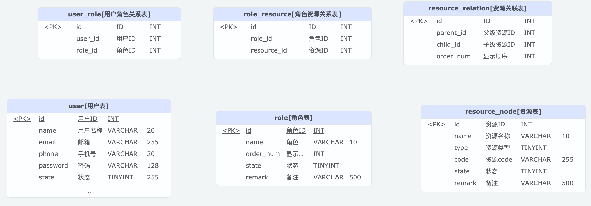

# Watermelon 用户权限管理系统
<p align="center">
  <a href="https://github.com/Yi-Xing/watermelon" target="_blank">
   
  </a>
</p>

## 项目简介

Watermelon 是一个基于 Spring Boot 3.2 的用户权限管理系统，采用领域驱动设计（DDD）架构模式，实现了完整的 RBAC（基于角色的访问控制）权限模型。系统提供用户管理、角色管理、资源管理等核心功能，支持细粒度的权限控制。

## 🔗 相关链接

<div align="center">

### 📦 项目仓库

[](https://github.com/Yi-Xing/watermelon-vue)
[](https://github.com/Yi-Xing/watermelon)

### 📸 文档与支持

[](https://github.com/Yi-Xing/watermelon-vue?tab=readme-ov-file#-%E7%B3%BB%E7%BB%9F%E6%88%AA%E5%9B%BE)
[](https://github.com/Yi-Xing/watermelon/issues)

</div>

## 🏗️ 系统架构

### 技术栈

- **框架**: Spring Boot 3.2.0
- **JDK**: Java 21
- **数据库**: MySQL 8.0+
- **ORM**: MyBatis Plus 3.5.12
- **身份验证**: JWT (jsonwebtoken 0.12.3)
- **日志**: Log4j2
- **构建工具**: Maven

### 模块结构

```
watermelon/
├── watermelon-api/          # API 接口定义模块
└── watermelon-service/      # 服务实现模块
    ├── api/                 # 控制器层
    ├── application/         # 应用服务层
    ├── domain/              # 领域模型层
    ├── infrastructure/      # 基础设施层
    └── common/              # 公共组件
```

### 架构设计

采用分层架构 + DDD 设计模式：

- **API层**: RESTful API 接口定义
- **应用服务层**: 业务用例编排，DTO转换
- **领域层**: 核心业务逻辑，聚合根，领域服务
- **基础设施层**: 数据访问，外部服务集成
- **公共层**: 工具类，常量，异常处理

## 🚀 功能特性

### 核心功能

1. **用户管理**
   - 用户创建、查询、更新、删除
   - 密码重置和加密存储
   - 用户状态管理
   - 用户角色关联

2. **角色管理**
   - 角色创建、查询、更新、删除
   - 角色资源权限分配
   - 角色状态管理

3. **资源管理**
   - API资源定义和管理
   - 菜单资源管理
   - 资源树形结构
   - 资源关系管理

4. **权限控制**
   - 基于JWT的身份认证
   - 细粒度的接口权限控制
   - 角色-资源权限映射
   - 权限拦截器

### 技术特性

- ✅ JWT Token 认证授权
- ✅ BCrypt 密码加密
- ✅ 链路追踪
- ✅ 统一异常处理
- ✅ 参数校验
- ✅ 分页查询
- ✅ Excel 导入导出
- ✅ 异步日志
- ✅ 多环境配置

## 📊 数据库设计

### 核心表结构


## 🛠️ 快速开始

### 环境要求

- JDK 21+
- Maven 3.6+
- MySQL 8.0+

### 安装步骤

1. **克隆项目**
```bash
git clone <repository-url>
cd watermelon
```

2. **数据库初始化**
```bash
# 执行数据库脚本
# 默认账号：admin@fblue.top 密码：admin123
watermelon-service/src/main/resources/sql
```

3. **配置环境变量**
```bash
export profile_name=dev
export mysql_url=localhost:3306
export mysql_username=root
export mysql_password=your_password
export jwt_secret=6aLAFwVakF9GD3LyrvUB8JZRgIE3yuoMiDM9iiPsS5k48JnU24Jt0IL+qHSrMRAWQdJE3c8s66OQjA3mJxPrlg==
```

### 配置说明

主要配置文件：
- `application.properties` - 主配置文件
- `application-dev.properties` - 开发环境配置
- `application-prod.properties` - 生产环境配置
- `log4j2-spring.xml` - 日志配置

## 🔐 权限控制

### 权限模型

系统采用 RBAC（Role-Based Access Control）权限模型：

```
用户(User) ← 多对多 → 角色(Role) ← 多对多 → 资源(Resource)
```

### 权限验证流程

1. **Token认证拦截器**: 验证JWT Token有效性
2. **权限验证拦截器**: 检查用户是否有访问特定接口的权限
3. **权限判断逻辑**:
   - 获取当前用户ID
   - 查询用户关联的角色列表
   - 获取角色关联的资源权限
   - 验证请求的接口资源是否在用户权限范围内

### 资源编码规则

```
系统代码:请求方法:请求路径
例如: watermelon:GET:/api/admin/user/list
```

## 📝 日志配置

系统使用 Log4j2 进行日志管理：

- **控制台输出**: 开发环境启用
- **文件输出**: `logs/watermelon.log`
- **错误日志**: `logs/error/watermelon-error.log`
- **链路追踪**: 每个请求包含唯一的 traceId

## 🐳 部署

### Docker 部署

项目包含 Dockerfile 和 deployment.yaml：

```bash
# 构建镜像
docker build -t watermelon:latest .

# 运行容器
docker run -d \
  -p 8080:8080 \
  -e profile_name=prod \
  -e mysql_url=your-mysql-host:3306 \
  -e mysql_username=root \jwt_secret
  -e mysql_password=your-password \
  -e jwt_secret=your-secret \
  watermelon:latest
```

### Kubernetes 部署

```bash
kubectl apply -f deploy/deployment.yaml
```


## 📄 许可证

本项目采用 MIT 许可证。详情请参阅 [LICENSE](LICENSE) 文件。

## 📞 联系方式

<div align="center">

如有问题或建议，欢迎通过 GitHub Issues 反馈交流

[](https://github.com/Yi-Xing/watermelon/issues)

</div>

