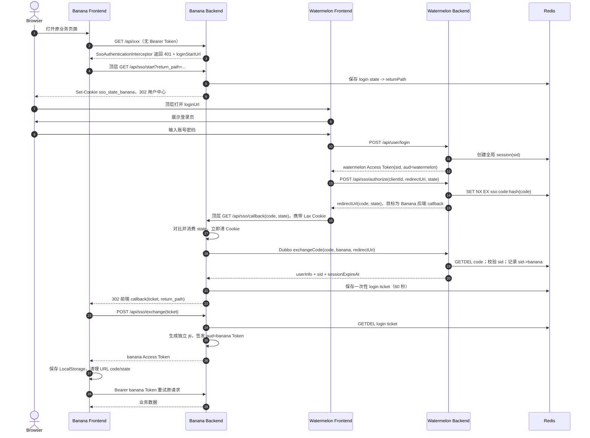
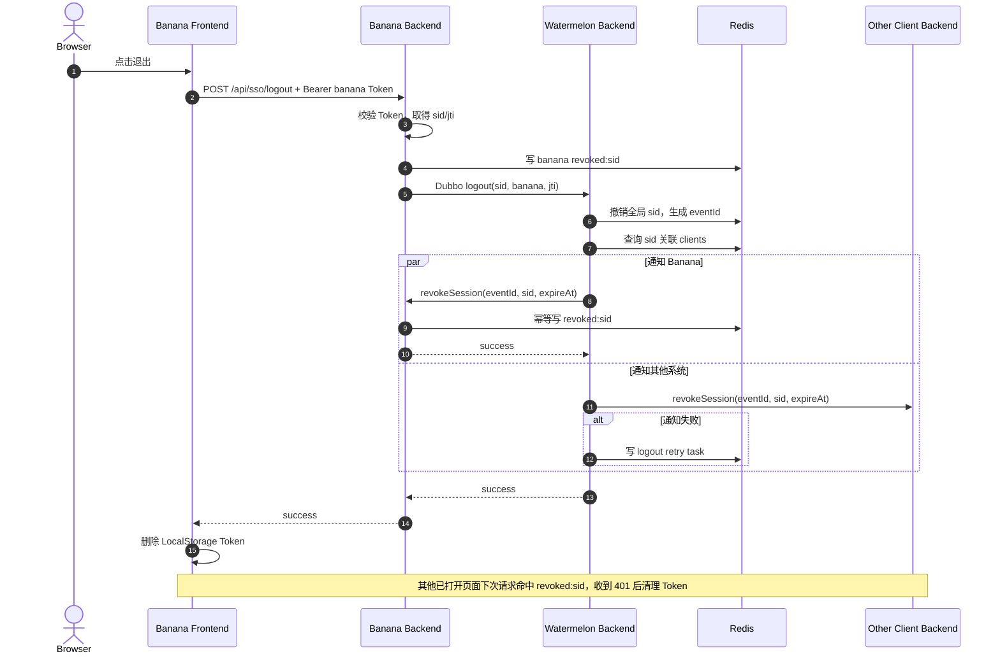

# 单点登录（SSO）详细技术实现方案

> 设计依据：[v1.2.0 单点鉴权中心-技术设计（单点）](https://my.feishu.cn/docx/Kpnmdkl0MoFhsKxkfnccZ8Kmn5b)，读取版本 `revision_id=194`。<br>
> 涉及仓库：`watermelon`（用户中心后端）、`water`（公共依赖）、`banana`（首个接入 SSO 的业务系统）。<br>
> 本文以飞书文档前半部分确定的 **`sid + Back-Channel Logout`** 为最终口径；文档后半部分和当前 `watermelon-auth` 草稿中的“跨系统共享 jti”是旧口径，本文给出对应迁移方案。

> 实施状态（2026-07-30）：第 2.1 节第 1–8、10 项、第 2.2 节和第 2.3 节已落地。第 2.1 节第 9 项的 Redis 可靠重试队列/定时补偿按当前要求暂不实现，通知失败仅记录错误日志。`watermelon-auth` 按第 7.1 节的短期保留方案作为用户中心 SSO Server 模块，公共鉴权能力已全部迁入 `water/water-auth`，并由 `watermelon-service` 显式依赖。

## 1. 目标与范围

本次实现需要满足：

1. `banana` 没有独立登录页，未登录时跳转到 `watermelon` 登录页。
2. 用户在 `watermelon` 登录后，返回 `banana` 原页面并获得 `banana` 自己的 Access Token。
3. 同一浏览器已经登录 `watermelon` 时，再访问其他接入系统不需要重复输入账号密码。
4. 各系统 **不共享 Access Token**：
   - `watermelon` Token：`aud=watermelon`；
   - `banana` Token：`aud=banana`；
   - 每枚 Token 有独立 `jti`；
   - 同一次全局登录产生的 Token 使用同一个 `sid`。
5. 从任一系统退出时，用户中心撤销全局 `sid`，并通过后端通道通知所有已登录系统；旧 Token 即使被复制也不能重新使用。
6. `water` 提供可复用的 HTTP 鉴权、JWT 校验、用户上下文和 Dubbo 上下文透传能力；业务 RPC、用户数据和登录流程仍归属业务项目，公共包不依赖具体业务表。

部署约束：飞书设计说明前端域名和 API 域名可能属于不同主域。本文因此默认采用“前端顶层跳转到 Client 后端 `/api/sso/start` -> 用户中心 -> Client 后端 `/api/sso/callback`”的跨站安全流程。这样 `SameSite=Lax` 的 state Cookie 能在两次顶层 GET 中可靠写入和携带；不能使用“跨站 XHR 先接收 Lax Cookie，再 POST code”的实现。

### 1.1 不在本次后端范围内的内容

- `banana`、`watermelon` 前端工程不在已提供的三个仓库中。本文会定义前端必须遵守的接口和跳转协议，但不指定前端文件路径。
- V1 不实现 Refresh Token 和滑动续期。全局会话固定过期，业务系统 Token 的过期时间不得晚于全局会话过期时间。
- V1 页面不会依赖 WebSocket/SSE 做“无请求时立即跳登录页”；页面下一次请求收到 `401` 后清理本地 Token 并重新发起 SSO。后续如有强实时需求再增加推送。

## 2. 当前代码现状与必须修正的问题

### 2.1 `watermelon`

当前已有：

- `watermelon-service`：账号密码登录、HS512 JWT、`TokenAuthInterceptor`、`PermissionAuthInterceptor`、`UserContext`、Dubbo `UserRpc`。
- `watermelon-api`：已有 `AuthRpc`、`SystemTokenRevokeRpc`、code 换用户信息和退出相关 DTO。
- `watermelon-auth`：已有一套 SSO 草稿，包括 HTTP Token 拦截器、Redis code、jti 黑名单、Dubbo 用户上下文 Filter、回调接口等。

必须修正：

1. 根 `pom.xml` 当前只聚合 `watermelon-api` 和 `watermelon-service`，没有聚合 `watermelon-auth`；该模块不会随根工程正常构建。
2. `watermelon-auth` 同时混放了公共 SDK 和用户中心服务端逻辑，职责不清：
   - 公共 HTTP/Dubbo 用户上下文能力应迁移至 `water`；
   - 用户中心的 session、code、client 注册和退出编排应放到 `watermelon-service`。
3. 当前实现用一个 `jti` 关联多个系统，违反最终方案。应改为：`sid -> clients`，每个系统自行生成独立 `jti`。
4. 当前 code 保存 `userId + jti + expiresIn`，应改为保存 `userId + sid + clientId + redirectUri + sessionExpireAt`。
5. 当前 code TTL 直接使用 Token 剩余时间，可能长达一个月；应为 `min(300 秒, 全局会话剩余秒数)`。
6. 当前回调白名单只按 host 后缀匹配，范围过大。必须按已注册的 `client_id + redirect_uri` 精确匹配协议、域名、端口和路径。
7. 当前 `AuthCallbackController` 在用户中心校验业务系统域的 state Cookie。跨域情况下用户中心读不到业务系统 Cookie；state 应由发起 SSO 的业务系统后端生成，并在业务系统的顶层 callback 接口中校验。
8. 当前 `TokenUtil` 只验签和 `exp`，没有强制校验 `iss`、`aud`、`sid`、`jti`。
9. 当前退出通知失败只写 error 日志，不满足可靠通知要求；至少需要 Redis 重试队列和定时补偿。
10. 当前 state Cookie 未设置 `Secure` 和 `SameSite=Lax`，且最大时间是 600 秒；按设计改为 300 秒并由配置控制。

### 2.2 `water`

当前已有：

- `water-framework`：`TraceInterceptor` 和 `TraceWebMvcConfig`；
- `water-dubbo`：RPC secret、trace、异常处理 Filter；
- 历史上用户鉴权类曾位于 `water-framework`，之后因业务耦合被移除。

本次不把 watermelon 业务逻辑重新塞回 `water-framework`，而是新增独立 `water-auth` 模块。它只包含通用模型、JWT 校验、撤销检查、HTTP 拦截器、上下文以及 Dubbo 上下文透传，不包含 `AuthRpc`、用户表查询或用户中心页面逻辑。

### 2.3 `banana`

当前已有：

- `banana-service` 已依赖 `water-dubbo` 和 `watermelon-api`；
- 已配置直连 `watermelon` 的 Dubbo 地址和 RPC secret；
- 所有 HTTP 业务接口位于 `/api/**`，目前没有登录、Token、Redis 撤销和 Web MVC 鉴权配置。

`banana` 将作为第一个 SSO Client，负责 code 兑换、签发 `aud=banana` 的本地 Token、校验本地 Token、处理退出以及接收用户中心的 Back-Channel Logout。

## 3. 总体架构与职责边界

| 项目/模块 | 角色 | 主要职责 | 不负责 |
|---|---|---|---|
| `water/water-auth` | 公共 SSO SDK | JWT 解析与严格校验、Redis 撤销查询、HTTP 鉴权拦截器、state Cookie、用户上下文、401 响应、Dubbo 用户上下文 Filter | 登录页面、用户查询、client 注册、code 数据、业务权限 |
| `water/water-dubbo` | 公共 RPC 基础设施 | RPC secret、trace、统一异常；继续作为服务间可信通道 | SSO 会话编排 |
| `watermelon/watermelon-api` | SSO RPC 契约 | code 兑换、全局退出、Back-Channel Logout 的接口和 DTO | 具体实现 |
| `watermelon/watermelon-service` | SSO Authorization Server + 用户中心 | 账号密码登录、全局 session、client/redirect_uri 校验、授权码签发与消费、`sid` 撤销、退出通知与重试 | 签发 banana 的业务 Token |
| `banana/banana-service` | SSO Client + Resource Server | 发起登录挑战、校验 state、RPC 兑换 code、签发/校验 banana Token、本地撤销、接收退出通知 | 校验用户密码、维护全局 session |

### 3.1 关键标识的唯一含义

| 字段 | 由谁生成 | 唯一性/生命周期 | 使用方式 |
|---|---|---|---|
| `sub` | 用户中心 | 用户中心签发方下稳定 | 取用户 ID 的字符串形式 |
| `sid` | 用户中心登录成功时 | 一次全局登录会话 | 跨系统关联与全局退出的唯一依据 |
| `jti` | 每个 Token 的签发方 | 每枚 Token 唯一 | 单 Token 审计、重放检测、精确撤销 |
| `state` | 发起 SSO 的 Client 后端 | 一次浏览器跳转，5 分钟 | 防登录 CSRF，绑定“发起”和“回调” |
| `code` | 用户中心 | 一次性、5 分钟 | 浏览器只传递 code；用户数据仅通过后端 RPC 兑换 |
| `eventId` | 用户中心退出编排 | 一次退出事件 | Back-Channel Logout 幂等与重试 |

## 4. JWT 设计

### 4.1 用户中心 Access Token

```json
{
  "iss": "watermelon",
  "aud": ["watermelon"],
  "sub": "10001",
  "sid": "01J...",
  "jti": "01J...",
  "userId": 10001,
  "iat": 1760000000,
  "exp": 1762592000
}
```

### 4.2 Banana Access Token

```json
{
  "iss": "banana",
  "aud": ["banana"],
  "sub": "10001",
  "sid": "与用户中心相同的 sid",
  "jti": "banana 新生成的唯一 jti",
  "userId": 10001,
  "username": "demo",
  "iat": 1760000100,
  "exp": 1762592000
}
```

签发约束：

- `banana.exp = min(用户中心 sessionExpireAt, 当前时间 + banana 配置的最大 Token 时长)`。
- 每次 code 兑换都生成新的 `jti`，不得复用用户中心 Token 的 `jti`。
- Access Token 放在对应前端 Origin 的 LocalStorage；请求后端时使用 `Authorization: Bearer <token>`。
- 服务端必须同时校验签名、算法白名单、`iss`、`aud`、`exp`、`sub`、`sid`、`jti`，以及 `revoked:sid`/`revoked:jti`。
- 日志禁止输出完整 Token、code、state 和密钥。可记录 `sid/jti` 的前 8 位或 SHA-256 摘要。

### 4.3 签名策略

结合当前代码，V1 可继续使用每个系统独立的 HS512 secret：

- `watermelon` 只用 `watermelon` secret 签发和校验自己的 Token；
- `banana` 只用 `banana` secret 签发和校验自己的 Token；
- 用户中心不直接解析 banana Token，banana 先本地验签，再通过受 RPC secret 保护的 Dubbo 调用提交已验证的 `sid`。

中长期建议改为 RS256/ES256，并增加 `kid` 支持密钥轮换。无论采用何种签名算法，都必须显式限制算法，不能信任 JWT header 自报的任意算法。

## 5. Redis 数据结构

所有 key 建议统一以 `sso:` 开头，并对 code、Token 摘要等敏感随机值使用 SHA-256 后再作为 key 后缀。

| Key | 所在系统 | 类型/Value | TTL | 用途 |
|---|---|---|---|---|
| `sso:session:{sid}` | watermelon | Hash：`userId/deviceCode/status/expireAt` | 到全局会话过期 | 全局会话主记录 |
| `sso:session:{sid}:clients` | watermelon | Set：`banana/...` | 到全局会话过期 | 已兑换过 code 的 Client 列表 |
| `sso:code:{sha256(code)}` | watermelon | JSON：`userId/sid/clientId/redirectUri/sessionExpireAt` | `min(300s, sessionRemaining)` | 一次性授权码 |
| `sso:revoked:sid:{sid}` | watermelon、banana | `eventId` 或退出时间 | `maxTokenExpireAt-now` | 全局会话撤销 |
| `sso:revoked:jti:{jti}` | Token 所属系统 | `reason` | `tokenExp-now` | 可选的单 Token 撤销 |
| `sso:logout:event:{eventId}` | banana | `1` | 至少到会话过期 | 退出通知幂等/防重放 |
| `sso:login-state:{sha256(state)}` | banana | JSON：`returnPath/createdAt` | 300s | 绑定登录发起请求和回跳目标 |
| `sso:login-ticket:{sha256(ticket)}` | banana | JSON：`userId/username/sid/sessionExpireAt` | 60s | 后端 callback 向前端安全转交一次性登录结果 |
| `sso:global-logout:retry:{sid}` | banana | JSON：`sid/clientId/jti/attempt` | 到会话过期 | Client 调用户中心全局退出失败后的本地补偿 |
| `sso:logout:retry` | watermelon | ZSet，score=下次重试时间 | 任务成功或会话过期 | Back-Channel Logout 重试队列 |
| `sso:logout:task:{eventId}:{clientId}` | watermelon | JSON task | 到会话过期 | 记录重试次数、错误和状态 |

关键实现规则：

1. code 使用 Redis 6.2 `GETDEL` 原子消费；如果部署版本不支持，使用 Lua 脚本完成“读取 + 删除”。
2. code 创建使用 `SET key value NX EX ttl`，理论碰撞时重新生成。
3. 撤销 key 不得在第一次命中或前端删除 Token 后提前删除。
4. `expiresIn <= 0` 时不再创建正 TTL key，直接把请求视为已过期。
5. `sid` 撤销 TTL 应覆盖该 session 下所有已签发 Token 的最大剩余时间。V1 所有业务 Token 都不得超过 session 的 `expireAt`，因此可直接使用 `sessionExpireAt-now`。

## 6. `water` 公共依赖项目实现

仓库：`/Users/yixingzhang/Documents/java/code/water`

### 6.1 新增 `water-auth` 模块

修改根 `pom.xml`：

```xml
<modules>
    <module>water-common</module>
    <module>water-framework</module>
    <module>water-dubbo</module>
    <module>water-log</module>
    <module>water-auth</module>
</modules>
```

新增 `water-auth/pom.xml`，主要依赖：

- `water-common`
- `water-dubbo`
- `spring-boot-starter-web`
- `spring-boot-starter-data-redis`
- `spring-boot-autoconfigure`
- `jjwt-api/impl/jackson 0.12.3`
- `spring-boot-configuration-processor`

公共模块不得依赖 `watermelon-api`，避免基础设施层反向绑定某个业务项目。

### 6.2 建议目录和类

```text
water-auth/src/main/java/top/fblue/auth/
├── annotation/
│   └── SsoPublic.java
├── config/
│   ├── SsoAuthProperties.java
│   └── SsoWebMvcAutoConfiguration.java
├── context/
│   ├── SsoPrincipal.java
│   ├── UserContext.java
│   └── UserRpcContext.java
├── jwt/
│   ├── JwtTokenService.java
│   ├── JwtClaimsValidator.java
│   └── JwtSigningProperties.java
├── repository/
│   ├── TokenRevocationRepository.java
│   └── RedisTokenRevocationRepository.java
├── web/
│   ├── SsoAuthenticationInterceptor.java
│   ├── SsoStateCookieService.java
│   └── SsoUnauthorizedWriter.java
└── dubbo/filter/
    ├── DubboUserConsumerFilter.java
    └── DubboUserProviderFilter.java
```

同时增加：

```text
water-auth/src/main/resources/
├── META-INF/spring/org.springframework.boot.autoconfigure.AutoConfiguration.imports
└── META-INF/dubbo/org.apache.dubbo.rpc.Filter
```

另外在 `water-common/src/main/java/top/fblue/common/annotation/RpcPublic.java` 放置不依赖 Spring/Dubbo 的纯标记注解。`watermelon-api` 已依赖 `water-common`，因此 RPC 接口可以直接使用该注解，不需要让 API 契约模块依赖带 Web/Redis 的 `water-auth`。

### 6.3 HTTP 鉴权拦截器

创建位置：

`water-auth/src/main/java/top/fblue/auth/web/SsoAuthenticationInterceptor.java`

类型：Spring MVC `HandlerInterceptor`，不是 Servlet Filter。原因是现有项目已使用 MVC 拦截器链，且需要按 Controller 路径和 `@SsoPublic` 做精确放行。

`preHandle` 顺序：

1. `OPTIONS` 预检请求直接放行，CORS 由 Web MVC/网关统一处理。
2. 若 HandlerMethod 标注 `@SsoPublic`，放行。
3. 严格读取 `Authorization: Bearer <token>`；生产环境不再接受无 Bearer 前缀的裸 Token。
4. `JwtTokenService.parseAndValidate` 完成：
   - 固定算法验签；
   - 校验 `iss == sso.jwt.issuer`；
   - 校验 `aud` 包含 `sso.client-id`；
   - 校验 `exp/iat`，允许最多 30 秒时钟偏差；
   - 强制 `sub/sid/jti/userId` 非空。
5. 查询 Redis：
   - 命中 `sso:revoked:sid:{sid}` -> 401；
   - 命中 `sso:revoked:jti:{jti}` -> 401。
6. 构造 `SsoPrincipal`，写入 `request.setAttribute`，并绑定 `UserContext`。
7. 后续 Controller/权限拦截器通过 `UserContext.getRequiredPrincipal()` 获取用户。
8. `afterCompletion` 必须清理 ThreadLocal，防止 Tomcat 线程复用造成串用户。

伪代码：

```java
public boolean preHandle(HttpServletRequest req, HttpServletResponse resp, Object handler) {
    if (isPreflight(req) || isPublic(handler)) {
        return true;
    }
    try {
        String token = bearerTokenResolver.resolveRequired(req);
        SsoPrincipal principal = jwtTokenService.parseAndValidate(token);
        if (revocationRepository.isSidRevoked(principal.sid())
                || revocationRepository.isJtiRevoked(principal.jti())) {
            throw new SsoUnauthorizedException("session_revoked");
        }
        req.setAttribute(SsoConstants.CURRENT_USER, principal);
        UserContext.bind(principal);
        return true;
    } catch (SsoUnauthorizedException ex) {
        unauthorizedWriter.write(req, resp, ex);
        return false;
    }
}
```

### 6.4 未登录响应与 state Cookie

创建：

- `SsoUnauthorizedWriter`：返回统一 401 JSON，只返回 Client 后端的 `loginStartUrl`；
- `SsoStateCookieService`：由 Client 的 `/api/sso/start` 顶层 GET 调用，生成 256 bit 随机 state 并写 Cookie。

Cookie 属性：

```text
Name     = sso_state_{clientId}
HttpOnly = true
Secure   = true（本地开发可配置 false）
SameSite = Lax
Path     = /
Max-Age  = 300
```

Spring `Cookie` API 对 SameSite 支持不完整，建议使用 `ResponseCookie` 生成 `Set-Cookie` Header。

401 响应：

```json
{
  "success": false,
  "code": 401,
  "message": "登录状态无效",
  "data": {
    "loginStartUrl": "https://api.banana.example.com/api/sso/start"
  }
}
```

注意：后端通常不知道浏览器当前页面，因此前端只传当前站点内的相对 `return_path`。`/api/sso/start` 必须拒绝绝对 URL、`//host`、反斜杠和编码绕过，只允许以单个 `/` 开头的站内路由。Client 后端把该路由保存在 `sso:login-state:{sha256(state)}`，并使用配置中的固定用户中心地址和固定后端 callback URI 生成跳转地址。

如果前端和 API 确认属于同一 Site，也可简化为 XHR code 兑换；但不能在不同主域部署下依赖 `SameSite=Lax` Cookie 随跨站 POST/XHR 自动携带。另一种可选实现是 `SameSite=None; Secure` + credentialed CORS，但暴露面更大，不作为默认方案。

### 6.5 Web MVC 自动配置与顺序

创建：

`water-auth/src/main/java/top/fblue/auth/config/SsoWebMvcAutoConfiguration.java`

使用 `@AutoConfiguration`、`@ConditionalOnProperty(prefix="sso", name="enabled", havingValue="true")`，注册拦截器：

`water-auth` 内部 Bean 由 `AutoConfiguration.imports` 声明，不要求业务项目扫描 `top.fblue.auth`，也不要同时给同一个实现类加 `@Component` 后再手工扫描，避免生成重复 Bean。

```text
order=0   water-framework TraceInterceptor
order=10  water-auth SsoAuthenticationInterceptor
order=20  业务项目 PermissionAuthInterceptor（如有）
```

默认拦截 `/api/**`，公共模块不默认放行任何 `/api/**` 业务路径。各项目必须在确实公开的 Controller 方法上显式标注 `@SsoPublic`：banana 标注 start/callback/exchange，watermelon 标注账号密码登录。`OPTIONS`、`/error`、静态资源以及不属于 `/api/**` 的健康检查可按框架配置处理。

放行路径配置仅用于无法加注解的兼容接口，并应在启动日志打印最终列表。不要在公共包里默认放行 `/api/user/login`，否则所有接入项目中同名路径都会意外变成匿名接口。

### 6.6 Dubbo 用户上下文 Filter

创建位置：`water-auth`，通过 Dubbo SPI 自动激活：

- `DubboUserConsumerFilter`，`group=CONSUMER`；
- `DubboUserProviderFilter`，`group=PROVIDER`。

职责：

1. Consumer 从 `UserContext` 取 `SsoPrincipal`，把必要字段写入 attachment：`userId/sub/sid/jti/clientId`。
2. Provider 从 server attachment 读取字段，构造 `SsoPrincipal` 并绑定 `UserRpcContext`/ThreadLocal。
3. Provider 在 `finally` 中清理上下文；当前草稿的 Provider Filter 只读取并打印，没有绑定和清理，必须补齐。
4. 不建议直接把 Java DTO 作为 object attachment 传输，改为简单字符串字段，减少序列化兼容和类加载问题。
5. `@RpcPublic` 只表示“不要求浏览器用户上下文”，不表示跳过 `water-dubbo` 的 RPC secret 校验。`exchangeCode/logout/revokeSession` 必须继续通过 RPC secret 鉴别服务身份。

建议 Filter 顺序：

```text
Provider: GlobalException -> SecretAuth -> Trace -> UserContext -> Service
Consumer: Secret -> Trace -> UserContext -> Invoke
```

具体 order 需要与现有 Filter 的 `@Activate(order=...)` 统一后写成常量，避免多个模块都使用默认 order。

## 7. `watermelon` 用户中心实现

仓库：`/Users/yixingzhang/Documents/java/code/watermelon`

### 7.1 模块处理建议

推荐最终结构：

- 通用代码从 `watermelon-auth` 迁移到 `water/water-auth`；
- SSO 服务端代码迁移到 `watermelon-service`；
- RPC 契约保留在 `watermelon-api`；
- 完成迁移后删除 `watermelon-auth`，避免两套 `TokenAuthInterceptor/UserContext/TokenUtil` 同时被 Spring 扫描。

如果短期必须保留 `watermelon-auth`，至少要：

1. 将它加入 `watermelon` 根 `pom.xml` 的 `<modules>`；
2. 明确它只作为用户中心服务端模块，不再作为公共 SDK；
3. `watermelon-service` 显式依赖它；
4. 处理组件扫描和重复 Bean；
5. 仍需将 Client 侧拦截器迁入 `water-auth`。

### 7.2 `watermelon-api` RPC 契约调整

将现有 jti 语义改为 sid 语义。推荐接口：

```java
public interface SsoAuthRpc {
    ApiResponse<ExchangeCodeResponse> exchangeCode(ExchangeCodeRequest request);
    ApiResponse<Void> logout(GlobalLogoutRequest request);
}

public interface SsoLogoutNotifyRpc {
    ApiResponse<Void> revokeSession(SessionRevokeRequest request);
}
```

`ExchangeCodeRequest`：

| 字段 | 必填 | 说明 |
|---|---|---|
| `code` | 是 | 浏览器带回的一次性 code |
| `clientId` | 是 | 如 `banana`；必须与 Dubbo 调用方身份交叉校验 |
| `redirectUri` | 是 | 必须与 code 绑定值及注册值完全一致 |

`ExchangeCodeResponse`：

| 字段 | 说明 |
|---|---|
| `userId`/`username` | 签发业务 Token 所需的最小用户信息 |
| `sid` | 全局会话 ID |
| `sessionExpireAt` | epoch second；业务 Token 不得晚于此时间 |

`GlobalLogoutRequest`：

| 字段 | 说明 |
|---|---|
| `sid` | banana 已验证 Token 中的 sid |
| `clientId` | 发起退出的系统 |
| `jti` | 发起退出的本地 Token jti，仅用于审计 |
| `reason` | `USER_LOGOUT` 等 |

`SessionRevokeRequest`：

| 字段 | 说明 |
|---|---|
| `eventId` | 幂等键 |
| `sid` | 需要撤销的全局会话 |
| `sessionExpireAt` | 接收方计算 revoked sid TTL |
| `reason` | 退出原因 |
| `issuedAt` | 事件生成时间 |

`@RpcPublic` 标在接口方法上，表示不需要最终用户 attachment，但仍必须经过 `DubboSecretAuthFilter`。

### 7.3 用户中心新增/调整类

```text
watermelon-service/src/main/java/top/fblue/watermelon/
├── api/
│   └── SsoAuthorizationController.java
├── application/service/
│   ├── SsoApplicationService.java
│   └── impl/SsoApplicationServiceImpl.java
├── domain/sso/
│   ├── entity/SsoSession.java
│   ├── entity/AuthorizationCode.java
│   ├── entity/SsoClient.java
│   ├── repository/SsoSessionRepository.java
│   ├── repository/SsoClientRepository.java
│   └── service/SsoDomainService.java
├── infrastructure/repository/
│   ├── SsoSessionRedisRepository.java
│   ├── SsoClientConfigRepository.java
│   └── LogoutRetryRedisRepository.java
├── infrastructure/job/
│   └── LogoutRetryJob.java
└── rpc/
    └── SsoAuthRpcImpl.java
```

#### `LoginController` / 登录应用服务调整

账号密码校验成功后：

1. 生成高熵随机 `sid` 和用户中心 Token 的独立 `jti`；
2. 创建 `sso:session:{sid}`，状态 `ACTIVE`，过期时间固定为一个月；
3. 签发带 `aud=watermelon/sid/jti` 的用户中心 Access Token；
4. 返回 Token 给用户中心前端。

如果登录页带 `client_id/state/return_url`，前端登录成功后继续请求用户中心授权接口；不要把账号密码提交和授权码生成强耦合在一个事务中。

现有 `POST /api/user/logout` 也必须改为全局退出：从已验证的 `UserContext` 读取 sid/jti，调用同一套 `SsoApplicationService.logout(sid, watermelon, jti)`，写 revoked sid 并通知所有 Client；不能继续只调用无状态 JWT 的 `deleteToken`。

现有 `POST /api/user/token/refresh` 与 V1“固定共同过期时间、不滑动续期”冲突，V1 应停止前端调用并关闭该接口。若兼容期暂时保留，刷新后必须生成新 jti、保持原 sid，并且新 exp 不得晚于 sessionExpireAt；绝不能延长全局 session。

#### `SsoAuthorizationController`

建议接口：

```text
POST /api/sso/authorize
Authorization: Bearer <watermelon-token>
Body: { clientId, redirectUri, state }
```

处理：

1. 由用户中心公共鉴权拦截器验证 watermelon Token 和 sid 状态；
2. 按 `clientId` 查注册信息；
3. 对 `redirectUri` 做规范化后精确匹配，禁止 host 后缀匹配；
4. 生成 256 bit 随机 code，仅保存 code 的 SHA-256；
5. 保存 `userId/sid/clientId/redirectUri/sessionExpireAt`，TTL 最大 300 秒；
6. 返回 `{redirectUrl}`，格式为 `{redirectUri}?code=...&state=...`；
7. state 原样带回，不在用户中心校验业务系统 Cookie。

#### `SsoAuthRpcImpl.exchangeCode`

1. 通过 Dubbo secret 获取/确认调用方应用名；
2. 验证 `clientId` 与调用方应用映射一致；
3. 使用 `GETDEL sso:code:{sha256(code)}` 原子消费；
4. 校验 code 的 `clientId/redirectUri` 与请求完全一致；
5. 查询 `sso:session:{sid}`：必须存在、状态 ACTIVE、未过期、未命中 revoked sid；
6. 向 `sso:session:{sid}:clients` 加入 `clientId`；
7. 查询最小必要用户信息并返回 `userId/username/sid/sessionExpireAt`；
8. 任一步失败统一返回 `invalid_grant`，避免向调用方泄露 code 是否存在、属于哪个用户等细节。

#### `SsoAuthRpcImpl.logout`

1. 交叉校验 `clientId` 与 RPC 调用方；
2. 查询 `sso:session:{sid}`，不存在或已撤销时幂等返回成功；
3. 原子地将 session 状态改为 `REVOKED`，写 `sso:revoked:sid:{sid}`；
4. 生成唯一 `eventId`；
5. 查询 `sso:session:{sid}:clients`；
6. 为每个 Client 建立 logout task，立即调用 `SsoLogoutNotifyRpc.revokeSession`；
7. 成功标记 DONE；失败写入 `sso:logout:retry`，不得只记日志；
8. 返回成功。全局状态已撤销，因此某个 Client 通知失败不会使主退出失败。

### 7.4 Logout 重试机制

V1 可先用 Redis ZSet + `@Scheduled`：

- 第 1、2、4、8、16、30、60 秒重试，之后每 5 分钟重试；
- 超过 sessionExpireAt 后任务可结束，因为相关 Token 已自然过期；
- 每次请求携带相同 `eventId`，接收方必须幂等；
- 记录 `clientId/eventId/sid/attempt/lastError/nextRetryAt`；
- 指标至少包含 `logout.notify.success`、`logout.notify.failure`、`logout.retry.backlog`。

后续可替换为 MQ，但 RPC 接口和幂等键无需变化。

### 7.5 用户中心自身 HTTP 拦截链

`watermelon-service` 删除/替换当前重复的 `TokenAuthInterceptor`，统一使用 `water-auth`：

```text
TraceInterceptor             order 0
SsoAuthenticationInterceptor order 10
PermissionAuthInterceptor    order 20（仅 /api/admin/**）
```

同时把启动类改为单一、明确的扫描配置，至少包含 `top.fblue.watermelon`、`top.fblue.framework`、`top.fblue.dubbo`；不要保留一个只写 `top.fblue.dubbo` 的独立 `@ComponentScan`。`top.fblue.auth` 仍由 AutoConfiguration 加载。

放行：

- `/api/user/login`
- 用户中心前端静态资源（如果由同一服务托管）
- `/actuator/health`

`/api/sso/authorize` 不能放行，它必须读取已登录用户的 `sid`。

### 7.6 Client 注册配置

V1 可配置化，后续再建表：

```yaml
sso:
  clients:
    banana:
      enabled: true
      redirect-uris:
        - https://banana.example.com/sso/callback
      dubbo-url: dubbo://banana.internal:20880?application=banana
```

白名单匹配必须包含 scheme、host、有效端口和 path。生产只允许 HTTPS；不接受 URL fragment；query 仅允许约定参数，不能把用户输入直接拼进最终跳转地址。

## 8. `banana` 接入实现

仓库：`/Users/yixingzhang/Documents/java/code/banana`

### 8.1 Maven 与启动配置

`banana-service/pom.xml` 新增：

```xml
<dependency>
    <groupId>top.fblue</groupId>
    <artifactId>water-auth</artifactId>
    <version>${revision}</version>
</dependency>
```

`watermelon-api` 已存在，继续用于 SSO RPC 契约。

修正 `BananaServiceApplication` 的扫描范围，确保同时扫描 banana 自身和公共包：

```java
@SpringBootApplication(scanBasePackages = {
    "top.fblue.banana",
    "top.fblue.framework",
    "top.fblue.dubbo"
})
```

`top.fblue.auth` 通过 Spring Boot AutoConfiguration 自动加载，不放入组件扫描列表。

当前单独的 `@ComponentScan(basePackages={"top.fblue.framework", "top.fblue.dubbo"})` 有覆盖默认扫描范围的风险，接入时必须通过启动测试确认 `OssController`、SSO Controller 和公共鉴权 Bean 都已注册。

### 8.2 Banana 新增类

```text
banana-service/src/main/java/top/fblue/banana/
├── api/
│   └── SsoController.java
├── application/dto/
│   ├── SsoExchangeDTO.java
│   └── SsoLogoutDTO.java
├── application/vo/
│   └── SsoTokenVO.java
├── application/service/
│   ├── BananaSsoApplicationService.java
│   └── impl/BananaSsoApplicationServiceImpl.java
├── domain/auth/repository/
│   └── UserCenterSsoRepository.java
├── infrastructure/repository/
│   └── UserCenterSsoRepositoryImpl.java
├── infrastructure/config/
│   └── BananaSsoConfig.java
├── infrastructure/job/
│   └── GlobalLogoutRetryJob.java
└── rpc/
    └── SsoLogoutNotifyRpcImpl.java
```

### 8.3 Banana HTTP 接口

#### 登录发起接口

```text
GET /api/sso/start?return_path=/原业务页面
```

该接口标注 `@SsoPublic`，并且必须由前端使用 `window.location.assign(...)` 发起顶层导航，不能用 fetch 调用。

处理步骤：

1. 校验 `return_path` 只能是 banana 前端站内相对路径；
2. 生成 256 bit state；
3. 写 `HttpOnly; Secure; SameSite=Lax; Max-Age=300` 的 `sso_state_banana` Cookie；
4. 写 `sso:login-state:{sha256(state)}`，Value 保存 returnPath，TTL 300 秒；
5. 302 跳转至用户中心固定登录地址，参数包含 `client_id=banana`、state 和已注册的固定 `redirect_uri=https://api.banana.example.com/api/sso/callback`。

#### 后端回调接口

```text
GET /api/sso/callback?code=...&state=...
Cookie: sso_state_banana=...
```

该请求是浏览器从用户中心发起的顶层 GET，因此 `SameSite=Lax` Cookie 可以携带。

处理步骤：

1. 从 HttpOnly Cookie 读取 state，并与 query state 做常量时间比较；
2. 使用 `GETDEL sso:login-state:{sha256(state)}` 取得 returnPath，确保 state 一次性；
3. 无论成功或失败都清除 state Cookie；
4. state 不一致或 Redis state 不存在时，不调用用户中心 RPC，跳转前端统一登录失败页；
5. 调用 `SsoAuthRpc.exchangeCode(code, banana, 固定 callback redirectUri)`；
6. 收到 `userId/username/sid/sessionExpireAt` 后生成 256 bit 一次性 login ticket；
7. 写 `sso:login-ticket:{sha256(ticket)}`，TTL 60 秒，Value 保存兑换结果；
8. 302 跳转到配置的 banana 前端 callback：`https://banana.example.com/sso/callback?ticket=...&return_path=...`。不得把 Access Token 放入 URL。

#### login ticket 兑换接口

```text
POST /api/sso/exchange
Body: { ticket }
```

该接口标注 `@SsoPublic`，只放行 Access Token 鉴权；ticket 仍必须一次性、短效。

处理步骤：

1. 使用 `GETDEL sso:login-ticket:{sha256(ticket)}` 原子消费 ticket；
2. ticket 不存在或过期时返回 `SSO_INVALID_GRANT`；
3. 检查 session 剩余时间大于 0；
4. 生成 banana 独立 `jti`；
5. 签发 `iss=banana/aud=banana/sub=userId/sid/jti` 的 Access Token；
6. 返回 `{accessToken, tokenType:"Bearer", expiresAt}`；
7. 前端写入 banana Origin 的 LocalStorage，并立即用不带 ticket 的 URL 替换地址栏历史。

#### 退出接口

```text
POST /api/sso/logout
Authorization: Bearer <banana-token>
```

处理步骤：

1. 公共 `SsoAuthenticationInterceptor` 已完成 Token 和撤销校验；
2. 从 `UserContext` 读取 `sid/jti`；
3. 先把当前 `sid` 写入 banana 的 `sso:revoked:sid:{sid}`，保证本系统立即失效；
4. 调用用户中心 `SsoAuthRpc.logout`；
5. 调用成功时幂等返回 200；调用失败时把相同请求写入 `sso:global-logout:retry:{sid}`，返回 202 `logoutPending=true`，后台持续重试到成功或 session 自然过期；不能因为本地 Token 已撤销而丢失全局退出请求；
6. 前端在 200/202 时都删除 banana Token，并跳用户中心登录页或公共退出完成页；
7. 如果本地 Redis 写撤销记录失败，则返回 503，不得对外宣称退出成功。

### 8.4 Banana Back-Channel Logout RPC

`SsoLogoutNotifyRpcImpl` 使用 `@DubboService` 暴露：

```java
public ApiResponse<Void> revokeSession(SessionRevokeRequest request) {
    if (logoutEventRepository.exists(request.getEventId())) {
        return ApiResponse.success(null);
    }
    long ttl = request.getSessionExpireAt() - clock.instant().getEpochSecond();
    if (ttl > 0) {
        revocationRepository.revokeSid(request.getSid(), request.getEventId(), ttl);
        logoutEventRepository.markProcessed(request.getEventId(), ttl);
    }
    return ApiResponse.success(null);
}
```

要求：

- RPC 经过现有 `DubboSecretAuthFilter`，只接受用户中心配置的 secret；
- 相同 `eventId` 多次调用必须返回成功；
- 先写撤销记录再回成功；
- Redis 失败时 RPC 返回失败，让用户中心进入重试，不能吞异常；
- 不需要知道 banana 当前有哪些浏览器 Token，因为所有相关 Token 都包含相同 sid。

### 8.5 Banana HTTP 拦截配置

公共自动配置拦截 `/api/**`。Banana 配置：

```yaml
sso:
  enabled: true
  client-id: banana
  login-url: https://user.example.com/login
  authorize-url: https://user.example.com/api/sso/authorize
  state-cookie:
    name: sso_state_banana
    secure: true
    same-site: Lax
    max-age-seconds: 300
  jwt:
    issuer: banana
    audience: banana
    secret: ${BANANA_JWT_SECRET}
    max-expiration-seconds: 2592000
  redis:
    key-prefix: sso:
  public-paths:
    - /api/sso/start
    - /api/sso/callback
    - /api/sso/exchange
    - /actuator/health
```

`OssController` 的 `/api/admin/oss` 会被自动拦截，无需在每个 Controller 重复写鉴权代码。若后续有业务权限校验，应在 SSO 拦截器之后增加 banana 自己的 `PermissionAuthInterceptor`。

## 9. 完整流程

### 9.1 首次访问 Banana



### 9.2 已登录用户中心后访问 Banana

与首次流程相同，但用户中心登录页发现本域已有有效 `watermelon` Token 后，直接调用 `/api/sso/authorize`，不展示账号密码表单。这样实现 SSO，既不共享 Cookie，也不共享业务 Token。

### 9.3 从 Banana 全局退出



## 10. 过滤器与拦截器落点总表

| 项目 | 类 | 类型 | 拦截范围 | 核心职责 |
|---|---|---|---|---|
| `water/water-framework` | 现有 `TraceInterceptor` | MVC Interceptor | `/api/**` | trace，order=0 |
| `water/water-auth` | 新建 `SsoAuthenticationInterceptor` | MVC Interceptor | 默认 `/api/**` | Bearer Token、claims、sid/jti 黑名单、UserContext、401，order=10 |
| `water/water-auth` | 新建 `DubboUserConsumerFilter` | Dubbo Consumer Filter | 业务 RPC | HTTP 用户上下文写入 RPC attachment |
| `water/water-auth` | 新建 `DubboUserProviderFilter` | Dubbo Provider Filter | 业务 RPC | attachment 转服务端用户上下文，并在 finally 清理 |
| `water/water-dubbo` | 现有 `DubboSecretConsumerFilter` | Dubbo Consumer Filter | 全部 RPC | 添加目标服务 secret |
| `water/water-dubbo` | 现有 `DubboSecretAuthFilter` | Dubbo Provider Filter | 全部 RPC | 校验调用方 secret，SSO RPC 也不能跳过 |
| `watermelon/watermelon-service` | 保留并调整 `PermissionAuthInterceptor` | MVC Interceptor | `/api/admin/**` | 用户中心资源权限，order=20 |
| `watermelon/watermelon-service` | 删除/替换现有 `TokenAuthInterceptor` | - | - | 避免与公共 SSO 拦截器重复执行 |
| `watermelon/watermelon-auth` | 迁移现有两个 `DubboUser*Filter` | - | - | 迁移到 `water-auth` 后原类删除 |
| `banana/banana-service` | 不重复创建 Token 拦截器 | 使用公共 Bean | `/api/**` | 配置 clientId/issuer/audience/放行路径即可 |
| `banana/banana-service` | 可选 `PermissionAuthInterceptor` | MVC Interceptor | `/api/admin/**` | banana 自身细粒度 RBAC，order=20 |

HTTP 链路不额外创建 Servlet `Filter`。只有在以后需要非常早地处理跨框架请求、统一包装 request body 或安全 Header 时再考虑 `OncePerRequestFilter`；当前认证放在 MVC Interceptor 更符合现有工程结构。

## 11. 错误码与 HTTP 行为

| 场景 | HTTP/RPC 结果 | code | 前端行为 |
|---|---|---|---|
| 无 Token/Token 过期/签名错误 | HTTP 401 | `ApiCodeEnum.UNAUTHORIZED`（JSON 为 `401`） | 清理 Token，顶层打开 loginStartUrl 发起 SSO |
| `aud/iss` 不匹配 | HTTP 401 | `ApiCodeEnum.UNAUTHORIZED`（JSON 为 `401`） | 清理 Token，重新登录；上报警告指标 |
| sid/jti 已撤销 | HTTP 401 | `ApiCodeEnum.UNAUTHORIZED`（JSON 为 `401`） | 清理 Token，重新登录 |
| state 缺失或不一致 | HTTP 400 | `ApiCodeEnum.BAD_REQUEST`（JSON 为 `400`） | 清 state Cookie，重新发起完整登录 |
| code 无效/过期/已使用 | HTTP 400 | `ApiCodeEnum.BAD_REQUEST`（JSON 为 `400`） | 清理 URL，重新发起登录 |
| redirectUri 未注册 | HTTP 400 | `ApiCodeEnum.BAD_REQUEST`（JSON 为 `400`） | 停止跳转并记录安全日志 |
| Redis 不可用，无法确认撤销状态 | HTTP 503 | `ApiCodeEnum.SERVICE_UNAVAILABLE`（JSON 为 `503`） | 不放行业务请求（fail closed） |
| Back-Channel 通知失败 | RPC error | 内部错误 | 当前仅记录错误日志；2.1 第 9 条的可靠重试队列暂不实现 |

401 响应不要使用 302：XHR/fetch 遇到跨域 302 容易被 CORS 和前端路由干扰，且后端无法准确知道当前前端页面。统一返回结构化 401，由前端执行顶层跳转。

## 12. 安全实现要求

1. 全链路 HTTPS；生产 state Cookie 强制 `Secure`。
2. LocalStorage 方案必须配合 CSP、依赖版本治理、禁止危险内联脚本、严格输入输出编码。
3. 不在 LocalStorage 保存 Refresh Token；V1 不提供 Refresh Token。
4. state/code 使用 `SecureRandom`，熵至少 128 bit，推荐 256 bit。
5. state 校验采用常量时间比较，成功和失败都清 Cookie。
6. code 只能由后端 RPC 兑换，浏览器不能直接调用用户中心 RPC/Token 接口。
7. redirect URI 精确白名单，禁止 `endsWith(domain)`、通配任意子域、协议降级和开放重定向。
8. Token parser 必须固定允许算法，强制校验 `iss/aud/exp/sid/jti/sub`。
9. RPC request 中的 `clientId` 不能单独作为可信身份，必须和 Dubbo 调用方应用名及 secret 交叉验证。
10. Redis key 中不直接保存原始 code；日志中不打印完整 code/state/Token/secret。
11. 登录、code 兑换、state 失败、redirect 拒绝、全局退出增加限流和安全审计。
12. CORS 只允许已注册前端 Origin 和必要 Header（尤其 `Authorization`），不能使用任意 Origin + credentials。

## 13. 配置清单

### 13.1 Watermelon

```properties
sso.enabled=true
sso.client-id=watermelon
sso.jwt.issuer=watermelon
sso.jwt.audience=watermelon
sso.jwt.secret=${WATERMELON_JWT_SECRET}
sso.session-expiration-seconds=2592000
sso.code-expiration-seconds=300
sso.state-expiration-seconds=300
sso.logout.retry-enabled=true

sso.clients.banana.redirect-uris[0]=https://banana.example.com/sso/callback
sso.clients.banana.dubbo-url=dubbo://banana.internal:20880?application=banana

spring.data.redis.host=${REDIS_HOST}
spring.data.redis.port=${REDIS_PORT:6379}
spring.data.redis.password=${REDIS_PASSWORD:}

rpc.auth-enabled=true
rpc.secret.watermelon=${WATERMELON_RPC_SECRET}
rpc.secret.banana=${BANANA_RPC_SECRET}
```

### 13.2 Banana

```properties
sso.enabled=true
sso.client-id=banana
sso.login-url=https://user.example.com/login
sso.authorize-url=https://user.example.com/api/sso/authorize
sso.redirect-uri=https://banana.example.com/sso/callback
sso.jwt.issuer=banana
sso.jwt.audience=banana
sso.jwt.secret=${BANANA_JWT_SECRET}
sso.jwt.max-expiration-seconds=2592000
sso.state-cookie.name=sso_state_banana
sso.state-cookie.secure=true
sso.state-cookie.same-site=Lax
sso.state-cookie.max-age-seconds=300

spring.data.redis.host=${REDIS_HOST}
spring.data.redis.port=${REDIS_PORT:6379}
spring.data.redis.password=${REDIS_PASSWORD:}

dubbo.watermelon.url=dubbo://watermelon.fblue.top:20880?application=watermelon
rpc.secret.watermelon=${WATERMELON_RPC_SECRET}
rpc.secret.banana=${BANANA_RPC_SECRET}
```

密钥不得在 Git 中写真实值。开发默认值只允许用于本机，生产环境没有密钥时应启动失败。

## 14. 测试方案

### 14.1 `water-auth` 单元测试

- 合法 Token：正确 issuer/audience/sid/jti，成功生成 `SsoPrincipal`。
- 错误签名、错误算法、错误 issuer、错误 audience、过期、缺少 sid/jti/sub 均拒绝。
- `revoked:sid` 和 `revoked:jti` 命中均返回 401。
- Redis 不可用时 fail closed，返回 503 而不是放行。
- `@SsoPublic` 和 OPTIONS 放行。
- Interceptor `afterCompletion`、Dubbo Provider Filter 异常路径都能清 ThreadLocal。
- Consumer Filter 不把上一个请求的 attachment 泄漏到下一个请求。

### 14.2 `watermelon-service` 集成测试

- 登录创建不同 sid；同一用户两次登录互不影响。
- code TTL 最大 300 秒。
- 同一 code 并发兑换 20 次，仅一次成功。
- clientId、redirectUri、Dubbo 调用方任一不匹配都拒绝。
- 已撤销/过期 sid 不能兑换 code。
- exchange 后正确写入 `sid -> banana`。
- logout 重复调用幂等。
- Back-Channel 首次失败后进入重试，恢复后成功，任务最终 DONE。
- redirect URI 的恶意子域、userinfo、端口、双编码、反斜杠等绕过用例全部拒绝。

### 14.3 `banana-service` 集成测试

- 未登录访问 `/api/admin/oss` 返回 401 和 loginStartUrl；顶层访问 start 后才写 state Cookie。
- callback 的 state 正确时 code 兑换成功并清 Cookie；state 错误时不调用 RPC。
- login ticket 并发兑换仅一次成功，60 秒后自动失效。
- banana Token 的 `aud/iss/sid/jti/exp` 正确，且 jti 与 watermelon Token 不同。
- banana Token 过期时间不晚于 sessionExpireAt。
- Back-Channel revoke 后旧 Token 立即 401。
- 相同 eventId 多次通知仍成功，Redis 只有一份有效记录。
- RPC secret 错误时不能调用 revoke 接口。

### 14.4 端到端验收

1. 无登录状态访问 banana 原页面 -> 用户中心登录 -> 回到原页面 -> 接口成功。
2. 用户中心已有登录态时访问 banana -> 不输入密码直接登录。
3. 同一个 sid 下 watermelon/banana Token 的 aud、jti 不同。
4. banana 退出后，watermelon 和其他 Client 的旧 Token 全部失效。
5. watermelon 退出后，banana 旧 Token 失效。
6. 一个设备退出不影响同一用户另一设备的另一个 sid。
7. 复制已退出 Token 到另一浏览器仍然 401。
8. code 重放、state 伪造、redirect URI 篡改均失败。

## 15. 监控与审计

指标：

- `sso_login_challenge_total{clientId,reason}`
- `sso_code_issue_total{clientId}`
- `sso_code_exchange_total{clientId,result}`
- `sso_token_reject_total{clientId,reason}`
- `sso_logout_total{sourceClient,result}`
- `sso_logout_notify_total{targetClient,result}`
- `sso_logout_retry_backlog`
- Redis 调用耗时和错误率

审计日志字段：

```text
traceId, eventType, userId, sidDigest, jtiDigest,
sourceClient, targetClient, result, reason, clientIp, userAgent, timestamp
```

不得记录完整 Token、code、state、JWT secret 或 RPC secret。

## 16. 发布与迁移顺序

1. 在 `water` 新增 `water-auth` 并发布新版本；先用测试服务验证 Bean 自动配置和 Dubbo SPI。
2. 调整 `watermelon-api` 为 sid 契约，建议通过新增接口/DTO 做一次兼容版本，避免直接修改旧序列化模型导致联调期间不兼容。
3. 在 `watermelon-service` 实现 session、code、client 注册、退出重试；保留旧登录接口但让新 Token 带 sid/aud/jti。
4. `banana-service` 引入 `water-auth`，实现 exchange/logout/revokeSession；先在非生产启用。
5. 前端接入 401 后顶层打开 loginStartUrl、login ticket 兑换、LocalStorage、URL 清理和 401 清 Token。
6. 联调首次登录、免登和双向退出。
7. 灰度开启 `sso.enabled=true`，观察 401 原因分布、code 兑换成功率和 logout retry backlog。
8. 所有接入方完成后，删除 `watermelon-auth` 中的旧 jti 共享实现和重复拦截器。

回滚原则：

- 新旧 RPC 契约并存一个发布周期；
- Redis key 使用新 `sso:` 前缀，不覆盖旧 key；
- `sso.enabled=false` 可关闭公共拦截器，但生产回滚前必须确认不会因此把原本受保护接口变成匿名接口；推荐切回旧鉴权 Bean，而不是简单关闭全部鉴权。

## 17. 实施检查清单

- [ ] `water-auth` 已加入 `water` 根 Maven modules 并发布。
- [ ] HTTP 使用公共 `SsoAuthenticationInterceptor`，没有重复 Token 拦截器。
- [ ] Dubbo Consumer/Provider 用户上下文 Filter 已绑定并在 finally 清理。
- [ ] 所有 Token 强制校验 `iss/aud/exp/sub/sid/jti`。
- [ ] 每个系统独立 jti，跨系统只共享 sid。
- [ ] state 在 Client 后端 start 接口生成，并在 Client 后端 callback 接口校验和一次性消费。
- [ ] redirect URI 精确匹配注册项。
- [ ] code 保存 SHA-256，TTL 不超过 300 秒，GETDEL 原子消费。
- [ ] 用户中心保存 `sid -> clients`，不再保存 `jti -> systems`。
- [ ] 全局退出撤销 sid，通知失败进入可靠重试。
- [ ] 撤销 key TTL 覆盖 Token 最大剩余有效期。
- [ ] banana 接收退出通知幂等，Redis 失败不吞异常。
- [ ] 401 返回结构化 loginStartUrl；前端顶层访问 start，由 start/callback 使用 302，XHR 业务接口不返回 302。
- [ ] LocalStorage、CSP、CORS、日志脱敏和密钥环境变量已落实。
- [ ] 首次登录、免登、双向退出、不同设备 sid 隔离已通过 E2E 验收。
